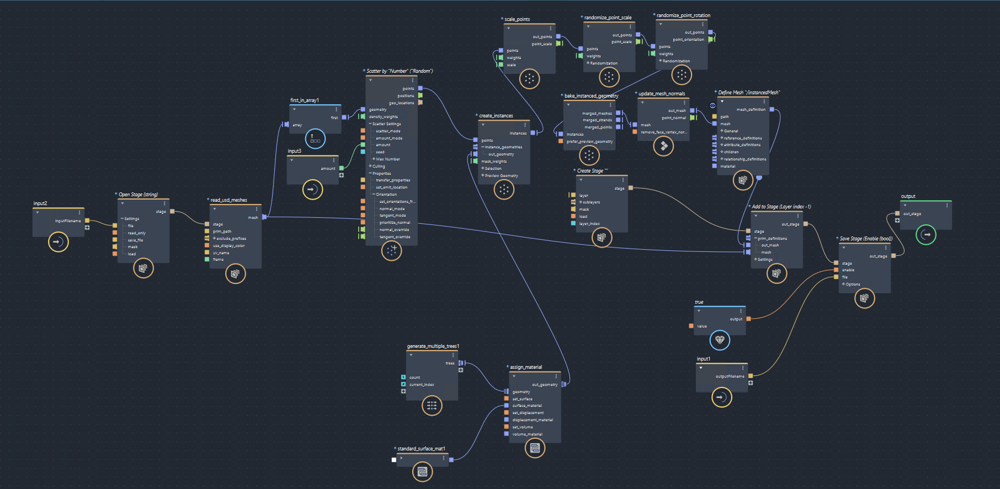

# Scatter trees sample

[](https://nodejs.org/)

[](https://forge.autodesk.com/en/docs/data/v2/reference/http/)


[](http://opensource.org/licenses/MIT)

This sample app let you scatter trees on a given object using the Flow Graph Engine API.
To do so, this sample use the bifrost executor to execute the provided bifrost graph.
This what the graph looks like when loaded in Maya.



## Setup

### Prerequisites

1. **APS Account**: Retrieve your app's `client_id` and `client_secret` from the [Developer Portal](https://aps.autodesk.com/myapps). 
2. **Node.js**: basic knowledge with [**Node.js**](https://nodejs.org/en/).
3. **JavaScript** basic knowledge. 
4. **Maya** (optional) to view/edit the Bifrost graph being executed


### Setup

Download & install [NodeJS](https://nodejs.org).

Install the required packages using `npm install`.

Set the following environment variable with your APS app client id and secret

```
APS_CLIENT_ID={YOUR_CLIENT_ID}
APS_CLIENT_SECRET={YOUR_CLIENT_SCRET}
```

### Running

By default, this Flow Graph Engine `Job` sample execute [this bifrost graph file](./input-data/addTrees.json) with the following inputs:

- [a usd file](./input-data/plane.usd) in which the first mesh prim will be used to scatter on
- An amount of trees to scatter.  Set to 1000 in the code.
- A usd output file name where to write the output scattered trees

To execute the code, run `node index.js`

## Further Learning

- [Build and modify graphs with Bifrost Graph Editor](https://help.autodesk.com/view/BIFROST/ENU/?guid=Bifrost_Common_build_a_graph_html)

## License

This code is licensed under the terms of the [MIT License](http://opensource.org/licenses/MIT). Please see the [LICENSE](LICENSE) file for more details.

